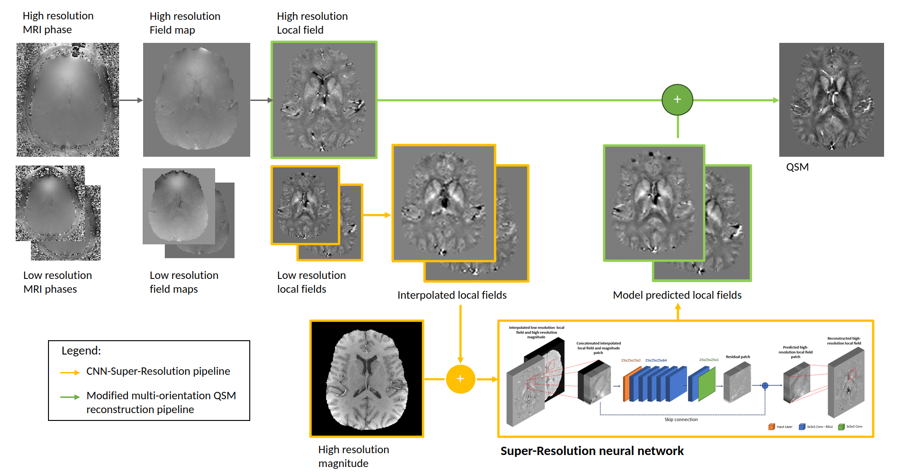

# SAMO-QSM : Super-Resolution Accelerated Multi-Orientation Quantitative Susceptibility Mappin


## Description

SAMO-QSM is an innovative approach to multi-orientation quantitative susceptibility mapping (QSM) reconstruction involving  low-resolution image acquisition. This two-part solution integrates a Deep Learning Super-Resolution Model to reconstruct high-resolution field maps from low-resolution counterparts, effectively reducing image acquisition time through super-resolution techniques. Additionally, SAMO-QSM employs a modified multi-orientation QSM reconstruction algorithm to optimize the overall QSM process, based on dipole kernel thresholding and orientation-based weighting mechanism.



## Getting Started

### Dependencies

* [FSL-bet2](https://fsl.fmrib.ox.ac.uk/fsl/fslwiki/FslInstallation) (Brain Extraction Tool)
* [ANTs Registration and Bias Field Correction](http://stnava.github.io/ANTs/)
* [MEDI Tool Box](https://pre.weill.cornell.edu/mri/pages/qsm.html)
* [STI Suite V3.0](https://chunleiliulab.github.io/software.html)
* Python>=3.9
* MATLAB

### Installing

* Clone the repository
   ```sh
   git clone https://github.com/neuropoly/SAMO-QSM.git
   ```
* Add repo to python path
* Add FSL and ANTs to path
    * Make sure that N4BiasFieldCorrection, bet2, antsRegistration and antsApplyTransforms are executable from Terminal.
* Add MEDI Toolbox and STI Suite path to config/paths.py file.

### Repo Architecture
```sh
SAMO-QSM
├── README.md
├── prepare_data_from_echo_to_mag_and_phase.py # Script to merge GRE echo images
├── qsm_preprocessing_script_HR.py # Script to preprocess high resolution (HR) data for QSM reconstruction 
├── qsm_preprocessing_script_LR.py # Script to preprocess low resolution (LR) data for QSM reconstruction 
├── CNN/ # Super-Resolution CNN folder (python)
├── QSM/ # QSM reconstruction code folder (MATLAB)
├── src/ # Source code folder (python)
├── eval/ # Validation and evaluation scripts (python)
└── config/ # Configuration files containing Python dependencies, path definitions, etc.
```

### Usage

* Make sure data folder is formated as such
    ```
    Data
    ├── Central
    │   ├── *_e1.nii
    │   ├── *_e2.nii
    │   ├── ...
    │   ├── *_en.nii
    │   ├── *_e1_phs.nii
    │   ├── *_e2_phs.nii
    │   ├── ...
    │   ├── *_en_phs.nii
    │   └── (Optional) *_mask.nii # If not mask given, one will be generated using fsl-bet2
    ├── Extension 
    │   └── ...
    ├── Flexion
    │   └── ...
    ├── Left
    │   └── ...
    └── Right
        └── ...
    ```
* Run prepare_data_from_echo_to_mag_and_phase
    Output :
    ```
    Data
    ├── Central
    │   ├── *_e1.nii
    │   ├── *_e2.nii
    │   ├── ...
    │   ├── *_en.nii
    │   ├── *_e1_phs.nii
    │   ├── *_e2_phs.nii
    │   ├── ...
    │   ├── *_en_phs.nii
    │   ├── *_magnitude.nii # 4D magnitude image
    │   └── *_phase.nii # 4D phase image
    ├── Extension
    │   └── ...
    ├── Flexion
    │   └── ...
    ├── Left
    │   └── ...
    └── Right
        └── ...

    ```
* Run qsm_preprocessing_script_HR if data folder contains images with all same resolution or qsm_preprocessing_script_LR if data folder contains low-resolution data
Output: 
    ```
    Data
    ├── Central
    │   ├── *_e1.nii
    │   ├── *_e2.nii
    │   ├── ...
    │   ├── *_en.nii
    │   ├── *_e1_phs.nii
    │   ├── *_e2_phs.nii
    │   ├── ...
    │   ├── *_en_phs.nii
    │   ├── *_magnitude.nii 
    │   ├── *_phase.nii
    │   ├── (Optional)*_e1_mask.nii # 3D binary mask of region of interest, generated by qsm_preprocessing_script
    │   ├── *_phase_echoCombined.nii # 3D echo combined phase image, generated by qsm_preprocessing_script
    │   ├── *_fieldmap.nii # 3D unwrapped phase (field map) image, generated by qsm_preprocessing_script
    │   ├── *_localfield.nii # 3D local field phase (after background field removal) image, generated by qsm_preprocessing_script
    │   └── *_bckremoval_msk.nii # 3D eroded binary mask, generated by qsm_preprocessing_script
    ├── Extension 
    │   └── ...
    ├── Flexion
    │   └── ...
    ├── Left
    │   └── ...
    ├── Right
    │   └── ...
    ├── agg_localfield_ILR.nii (If low resolution data or simulated low resolution data) # Aggregated interpolated low resolution local fields, generated by qsm_preprocessing_script
    ├── agg_localfield_pred.nii (If low resolution data or simulated low resolution data) # Aggregated super-resolved local fields, generated by qsm_preprocessing_script
    ├── agg_localfield.nii (If high resolution data) # Aggregated high resolution local fields, generated by qsm_preprocessing_script
    ├── agg_mag.nii # Aggregated magnitude images, generated by qsm_preprocessing_script
    ├── rot_all.nii # Rotation matrices for all orientations  
    ├── localfield_ILR_workspace.nii # MATLAB workspace for QSM reconstruction, generated by qsm_preprocessing_script
    ├── localfield_pred_workspace.nii 
    ├── localfield_workspace.nii
    └── python_workspace.nii # Pickle dump of python workspace varibles
    ```
* Run QSM/modified_cosmos_recon_script.m
    Output:
    ```
    Data
    ├── Central/
    ├── Extension/
    ├── Flexion/
    ├── Left/
    ├── Right/
    ├── ...
    └── Results
        ├── ILR_localfields # Results from interpolated low-resolution local field maps
        │   └── w?_tkd? # Results folder using ? parameters (Ex.w0.5_tkd0.2 for 50% weighting and threshold at 0.2)
        │       ├── logfile.txt
        │       ├── mCosmos_ori3_CEF.nii
        │       ├── mCosmos_ori3_CEL.nii
        │       ├── ...
        │       ├── mCosmos_ori4_CEFL.nii
        │       ├── ...
        │       └── mCosmos_ori5_CEFLR.nii
        ├── pred_localfields # Results from super-resolved local field maps
        │   └── ...
        └── HR_localfields # Results from high-resolution local field maps
            └── ...
    ```

### Evaluation
This section provides scripts for evaluating the reconstruction performance of the method. To run these scripts successfully, ensure that the data folder adheres to the specified architecture outlined above.

#### Data Organization
Should you choose to execute with single orientation data, place single orientation data, generated from [sepia](https://github.com/kschan0214/sepia) or similar tools, in the results folder. Organize the single orientation data under the 'singleOri' subfolder, with each orientation in a separate directory.

#### File Naming Convention
The evaluation code assumes that the quantitative susceptibility maps (QSM) reconstructed follow a specific naming convention. The expected suffix for the QSM file is 'Chimap.nii*'. Feel free to customize the file naming conventions and directory structures within the code as needed for your specific use case.

#### Expected Data Folder Structure:
```
    Data
    ├── Central/
    ├── Extension/
    ├── Flexion/
    ├── Left/
    ├── Right/
    ├── ...
    └── Results
        ├── ILR_localfields 
        ├── pred_localfields
        ├── HR_localfields
        └── singleOri
            ├── central
            │   ├── FANSI_Chimap.nii.gz
            │   ├── ILSQR_Chimap.nii.gz
            │   ├── ...
            │   └── MEDI_Chimap.nii.gz
            ├── ext
            │   └── ...
            ├── flex
            │   └── ...
            ├── left
            │   └── ...
            └── right
                └── ...
```
#### Script Summaries
Main Scripts :
1. **calculate_metrics.py** script
    - Purpose : Calculates image quality metrics (1-NRMSE, XSIM, PSNR, and NMI)
for a set of images compared to a target image and organizes the results into a structured DataFrame.
    - Usage : Update the 'target_file', 'data_folder', 'msk_file' and 'resolutions' variables according to your data. Run the script to calculate image quality metrics and save the results in a CSV file named 'image_quality_metrics.csv' in the specified 'data_folder/results' directory. 
2. **calculate_susceptibility.py** script
    - Purpose : Extracts mean and standard deviation susceptibility values for different regions of interest (ROI) from quantitative susceptibility maps. Uses Label map file from config to delimitate the different regions of interests,
    - Usage : Update the 'basefolder', 'msk_file', 'resolutions', 'folders' and 'suffixs' variables according to your data. Run the script to extract and aggregate susceptibility values for ROI and save the results in a CSV file named 'whole_mean_susceptibilities.csv' in the results folder. \

Visualisation Scripts:

3. **display_susceptibility.py** script
    - Purpose : Reads region of interest (ROI) susceptibility data from a CSV file and plots mean susceptibility values boxplots per region of interests, per method and resolution use for reconstrution. 
    - Usage : Input the susceptibility CSV file, generated by calculate_susceptibility. Run the script to generate boxplots illustrating mean susceptibility values for different methods and resolutions.
4. **table_maker.py** script
    - Purpose : Reads image quality metrics from a CSV file, and formats the results into a simple easily readable table displaying mean and standard deviation values for each group (combination of 'nOri', 'Method', and optionally 'Res'). 
    - Usage : Input the image quality metric CSV file, generated by calculate_metrics. Run the script to aggregate mean and standard deviation values grouped by category, format the results, displays and save them to a new formatted CSV file name 'stat_significance.csv' in results folder.
5. **perf_vs_time.py** script
    - Purpose : Reads image quality metrics from a CSV file, and plots performance (1-NRMSE and XSIM) accros time necessary for reconstruction. 
    - Usage : Input the image quality metric CSV file, generated by calculate_metrics.  Run the script to generate a line plot showcasing the performance metrics (1-NRMSE and XSIM) for different acquisitions times/methods.

Other Miscellaneous Scripts:

6. **cal_stat_sign.py** script
    - Purpose : Performs statistical analysis on image quality metrics obtained from different reconstruction methods.
    - Usage : Input the image quality metric CSV file, generated by calculate_metrics. Run the script to perform statistical tests and save the results in a CSV file named 'stat_significance.csv'
7. **diff_image.py** script
    - Purpose : Computes the voxel-wise difference between two NIfTI images and saves the resulting difference image.
    - Usage : Input the path to the folder containing the NIfTI images for comparison anf the path to the reference NIfTI image. Run the script to calculate the voxel-wise difference and save the resulting NIfTI images.
8. **save_nifti_png.py** script
    - Purpose : Takes a 2D slice from 3D NIfTI images and saves the slices as PNG files.
    - Usage : Input base folder containing images to be converted to PNG and output folder. Run the script to slice NIfTI images and save the slices as PNG files.

## Authors

[Noée Ducros-Chabot](https://github.com/noeedc)

